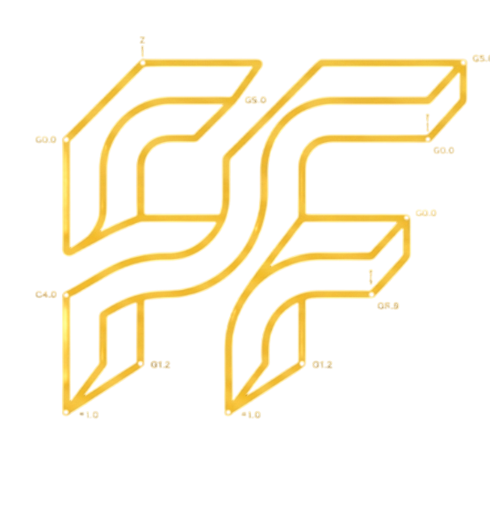

<div align="center">



# FANUC Forge

### Simulador CNC para fresadora con programación estilo FANUC

Editor, interpretación de código G, macros, coordenadas polares y simulación 2D/3D directamente desde el navegador.

[Ver simulador](https://silverpsychoo.github.io/fanuc-forge/) · [Reportar un problema](../../issues) · [Solicitar una mejora](../../issues)

</div>

---

## ¿Qué es FANUC Forge?

**FANUC Forge** es un simulador CNC educativo enfocado en fresadoras y programación estilo FANUC.  
Permite escribir, validar y visualizar programas sin necesidad de instalar software especializado.

El proyecto nació como una herramienta para practicar código G, macros, offsets, ciclos de barrenado y trayectorias antes de probarlas en una máquina real.

> [!WARNING]
> Este simulador es una herramienta educativa. No sustituye la validación en máquina, el *dry run*, el modo *single block*, la revisión de offsets, herramientas, sujeción y límites de carrera.

---

## Funciones principales

### Editor CNC

- Editor con números de línea.
- Autocompletado de códigos G, códigos M y comandos Macro.
- Descripción y ejemplo de cada código.
- Validación del programa.
- Historial con `Ctrl + Z` y `Ctrl + Y`.
- Importación de archivos `.NC`, `.TAP`, `.TXT`, `.CNC` y `.GCODE`.
- Guardado de programas y proyectos completos.

### Simulación

- Simulación de trayectorias en **2D y 3D**.
- Rotación, desplazamiento y zoom de la cámara.
- Visualización de movimientos rápidos y movimientos de corte.
- Mesa de trabajo configurable.
- Pieza desplazable dentro de la mesa.
- Entrada y salida de la herramienta fuera del material.
- Calidad de simulación ajustable.
- Simulación bloque por bloque.
- Control de velocidad de ejecución.

### Configuración CNC

- Sistemas de coordenadas `G54` a `G59`.
- Unidades métricas e imperiales:
  - `G21` — milímetros.
  - `G20` — pulgadas.
- Dimensiones personalizadas de mesa y material.
- Biblioteca de cortadores métricos e imperiales.
- Creación de herramientas personalizadas.
- Correctores de longitud y diámetro.

### Programación compatible

Entre las funciones interpretadas se encuentran:

- Movimientos `G00`, `G01`, `G02` y `G03`.
- Planos `G17`, `G18` y `G19`.
- Coordenadas absolutas e incrementales `G90` y `G91`.
- Coordenadas polares `G15` y `G16`.
- Rotación del sistema de coordenadas `G68` y `G69`.
- Ciclos de barrenado `G73` y `G81` a `G89`.
- Subprogramas con `M98` y `M99`.
- Llamadas Macro con `G65`.
- Variables Macro `#1`, `#100`, `#500`, etc.
- Condiciones `IF`, saltos `GOTO` y ciclos `WHILE / DO / END`.
- Funciones matemáticas como `SIN`, `COS`, `TAN`, `SQRT`, `ABS`, `ROUND`, `FIX` y `FUP`.

La compatibilidad puede variar según el control FANUC, las opciones instaladas y el fabricante de la máquina.

---

## Uso en línea

Abre el simulador desde GitHub Pages:

**https://silverpsychoo.github.io/fanuc-forge/**

No necesitas instalar Python ni mantener un servidor encendido.  
Toda la aplicación se ejecuta directamente en el navegador.

---

## Ejecución local

### Opción rápida

Abre `index.html` desde el navegador.

### Con servidor local

En Windows:

```bat
start_windows.bat
```

También puedes ejecutar:

```bash
python run_server.py
```

Después abre la dirección mostrada en la terminal.

---

## Controles

### Editor

| Acción | Atajo |
|---|---|
| Guardar programa | `Ctrl + S` |
| Abrir programa | `Ctrl + O` |
| Nuevo programa | `Ctrl + N` |
| Deshacer | `Ctrl + Z` |
| Rehacer | `Ctrl + Y` |
| Mostrar autocompletado | `Ctrl + Espacio` |
| Formatear código | `Alt + Shift + F` |

### Simulación

| Acción | Atajo |
|---|---|
| Ejecutar | `F5` |
| Validar | `F7` |
| Bloque por bloque | `F10` |
| Reiniciar | `Ctrl + R` |
| Maximizar simulador | `Shift + F11` |

### Cámara 3D

- Arrastrar con botón izquierdo: rotar.
- `Shift` + arrastrar: desplazar.
- Botón derecho + arrastrar: desplazar.
- Rueda del mouse: zoom.
- Doble clic: encuadrar la escena.

---

## Ejemplo básico

```gcode
O0001
G17 G21 G90 G40 G49 G80
T01 M06
G54
M03 S5000

G00 X0 Y0
G43 H01 Z20
G01 Z-5 F150
G01 X50 F300
G01 Y30
G01 X0
G01 Y0

G00 Z20
M05
M30
```

---

## Estructura del proyecto

```text
fanuc-forge/
├── assets/
│   └── logo.png
├── js/
│   ├── app.js
│   ├── expression.js
│   ├── gcode-data.js
│   ├── interpreter.js
│   └── simulator.js
├── samples/
├── index.html
├── styles.css
└── README.md
```

---

## Próximas mejoras

- Detección avanzada de colisiones.
- Mordazas, fixtures y elementos de sujeción.
- Compensación geométrica más precisa `G41/G42`.
- Visualización mejorada de ciclos y cavidades.
- Importación de modelos de pieza.
- Más perfiles de controles FANUC.
- Exportación de reportes de simulación.

---

## Contribuciones

Las sugerencias y reportes de errores son bienvenidos.

1. Abre un **Issue** explicando el problema o mejora.
2. Incluye el programa CNC utilizado.
3. Describe qué esperabas ver y qué ocurrió.
4. Adjunta una captura si es posible.

---

## Autor

Desarrollado por **Jonathan Leonel Maldonado Delgado**  
Ingeniería Mecatrónica — Universidad Politécnica de Victoria

GitHub: [@SilverPsychoo](https://github.com/SilverPsychoo)

---

## Aviso

FANUC Forge es un proyecto independiente con fines educativos.  
No está afiliado, patrocinado ni respaldado por FANUC Corporation.

---

<div align="center">

Hecho con código G, café y demasiadas pruebas de trayectorias.

</div>
=======
# Fanuc-Forge
Simulador CNC educacional 
>>>>>>> 1c59334480521e04721d36c5b40ed720c3b70964
